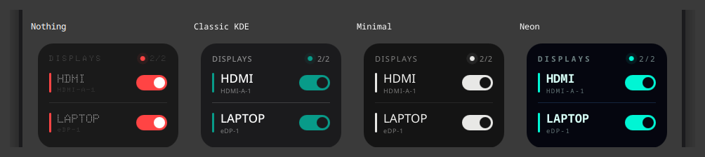

<div align="center">

# Nothing Display Toggle

**Switch any display on or off — one tap, no System Settings.**

Two KDE Plasma 6 widgets for multi-monitor setups, styled after the Nothing OS dot-matrix
look: a card for the desktop and a compact one for the panel.


</div>

---

## Why

If you run more than one screen, you constantly want one of them *gone* for a while — the
laptop panel while the machine is docked, the second monitor while you play something
fullscreen, the TV you only use on weekends. Doing that through **System Settings → Display
Configuration** is four clicks and a confirmation dialog, every single time.

This widget puts a switch for every connected display on your desktop, shows you at a glance
which ones are live, and refuses to let you turn off the last one.

## What it looks like

| All displays on | One display switched off | Four displays connected |
|:---:|:---:|:---:|
|  |  |  |
| The counter reads `2/2` and both switches are lit. | The laptop panel reads `SLEEPING`. The remaining display's switch dims — it is the last one on and cannot be turned off. | Rows appear per output. Two HDMI monitors are numbered `HDMI 1` / `HDMI 2`; the counter reads `3/4`. |

## Features

- **Every connected output, found automatically.** Nothing is hardcoded — rows appear and
  disappear as you plug monitors in and out, on any machine.
- **Labels you can actually read.** Outputs are named by what they are — `LAPTOP`, `HDMI`,
  `DP`, `VGA`, `DVI`, `TV` — numbered when several share a type, with the connector name
  (`HDMI-A-1`, `eDP-1`, …) underneath.
- **You cannot black out your machine.** The last enabled output is locked: its switch dims and
  the cursor turns to "not allowed". There is no way to reach a state with no screen on.
- **Always tells the truth.** State is re-read every 4 seconds, so the widget stays correct even
  when you change displays from System Settings, a keyboard shortcut, or another script.
- **Call your displays what you call them.** Rename any output from the settings — `Desk`, `TV`,
  `Left` — instead of living with `HDMI 2`. Names are keyed to the connector, so they come back
  when you plug the same display in again.
- **Four looks.** Nothing, Classic KDE, Minimal, Neon. Colours and typefaces change; sizes,
  spacing and motion do not.
- **Nothing OS styling by default.** Dot-matrix type, red accents, and a status dot that pings
  like radar while any display is live.

## Four looks



Right-click → **Configure… → Appearance**. Only colours and typefaces change between them —
sizes, spacing, radii and motion are identical, so the widget stays one design rather than four.
Both widgets carry the same four.

| | Colour | Type |
|---|---|---|
| **Nothing** (default) | Red on near-black | The bundled dot-matrix face |
| **Classic KDE** | Your desktop palette, accent included; follows light and dark | Your interface font |
| **Minimal** | None. A switched-on display is simply brighter than a switched-off one | Your interface font |
| **Neon** | Aqua and magenta on black | Monospace |

Minimal is dark like the others on purpose: the panel widget draws straight onto the panel,
where a light palette would disappear.

### Your own colour

Under the four looks there is a colour button. Pick anything and it replaces that look's accent
— the switches, the bar beside each name and the status dot all follow it, in both widgets.
**Use the look's own** puts it back. The rest of the palette stays with the look, so a colour
sits on top of a design rather than replacing it.

## Naming your displays

Right-click → **Configure… → Displays** gives every connected output a text field. Type
`Desk`, `TV`, `Left` — whatever you actually call it — and the row uses that instead of
`HDMI 2`. Empty a field to go back to the name the widget works out on its own, which is shown
in grey as the placeholder.

Names are keyed to the connector (`HDMI-A-1`, `eDP-1`), so they survive reboots and come back
when you plug the same display in again. The connector itself is still shown under the name.

## On the panel

The panel widget is the same thing in the space a panel has. By default it puts **one switch
per display straight on the panel** — one click, no popup — and falls back to a compact badge
once you connect more displays than a panel can reasonably hold.

```
one or two displays          many displays
┌──────────────────────┐     ┌──────────────────────┐
│ LAPTOP ◉  HDMI ◉     │     │ ● 3/4                │
└──────────────────────┘     └──────────────────────┘
  click a switch               click to open the card
```

Right-click → **Configure…** if you would rather fix it one way:

| Setting | What it does |
|---|---|
| **Automatic** (default) | Switches on the panel while they fit, a badge past the threshold |
| Switch to a badge above | How many displays "fit" — 2 by default |
| **Always show a switch per display** | Never collapses to a badge, however many displays you have |
| **Always show a badge** | Always one badge; the card opens as a popup on click |

Everything scales from the panel thickness, so it fits a slim panel and a tall one, and it
works in a vertical panel too — there the names are dropped and only the switches remain.

## Requirements

- KDE Plasma 6
- `kscreen-doctor` — ships with Plasma (part of `libkscreen`), so it is already there on a
  standard install

Works on both Wayland and X11.

## Install

**From the widget store**

Right-click the desktop → **Add Widgets…** → **Get New Widgets…** → search for
*Nothing Display Toggle*.

**From a release file**

```bash
kpackagetool6 --type Plasma/Applet --install nothing-display-toggle.plasmoid        # desktop
kpackagetool6 --type Plasma/Applet --install nothing-display-toggle-panel.plasmoid  # panel
```

Install either one on its own, or both. Use `--upgrade` instead of `--install` to update an
existing copy.

**From source**

```bash
git clone https://github.com/fatihaydost/nothing-display-toggle.git
cd nothing-display-toggle
./install.sh          # builds and installs both
```

> **Upgrading a widget that is already on screen?** Plasma loads an applet's QML once and keeps
> it for the life of the shell, so the copy you are looking at goes on running the old code
> until Plasma restarts. This is easy to misread, because the settings dialog *is* read fresh
> from disk: new settings pages appear while the widget itself ignores them. Run
> `./install.sh --reload`, or `systemctl --user restart plasma-plasmashell.service`.

Then right-click the **desktop** → **Add Widgets…** → drag *Nothing Display Toggle* out, or
right-click the **panel** → **Add Widgets…** → *Nothing Display Toggle (Panel)*.

> Not listed yet? Plasma caches the widget list. Restart it once:
> `systemctl --user restart plasma-plasmashell.service`

## Read this before you switch a monitor off

Turning an output off **removes it from the desktop layout**. Windows that were on it move to
the remaining screens, and so does anything sitting on that desktop — **including this widget**.

> **Put a copy on every screen.** That is how you switch a display back on: from the copy on a
> screen that is still awake. This is the panel widget's other reason to exist — a panel is
> usually already on every screen, so the switches follow you there.

This is also why the widget is not a screen blanker. Two different things are often called
"turning the screen off":

| | What happens | Wakes on mouse move? |
|---|---|---|
| **DPMS sleep** (`kscreen-doctor --dpms off`) | Screen goes dark, output stays in the layout | Yes — instantly, which makes it useless for parking one screen while you work on another |
| **Disable** (what this widget does) | Output leaves the layout, windows move away | No — it stays off until you switch it back on |

## Uninstall

```bash
kpackagetool6 --type Plasma/Applet --remove io.github.fatihaydost.displaytoggle
kpackagetool6 --type Plasma/Applet --remove io.github.fatihaydost.displaytoggle.panel
```

> In the desktop context menu, **Remove** takes the widget off the desktop.
> **Uninstall** deletes the package from disk. They are not the same thing.

## How it works

There is no daemon and nothing running in the background beyond a 4-second poll. State is read from `kscreen-doctor -j`, and a toggle runs exactly one command:

```bash
kscreen-doctor output.<connector>.disable   # or .enable
```

Plasma's own display configuration keeps track of the result, so the state survives reboots the
same way any other display setting does.

Both widgets run the same code. `shared/ui/` holds the part that talks to kscreen and the card
itself; `desktop/` and `panel/` add only their own `main.qml`, metadata, and — for the panel —
its settings page. `build.sh` copies `shared/` into each package, so a released `.plasmoid` is
still a single self-contained applet.

```
shared/ui/   DisplayController.qml   kscreen polling, toggles, output naming
             Theme.qml               the four palettes and typefaces
             ConfigTheme.qml         the Appearance settings page
             ConfigDisplays.qml      the Displays (renaming) settings page
             DisplayCard.qml         the card (desktop widget, and the panel popup)
             ToggleRow.qml           one row inside the card
             StatusDot.qml           the pinging red dot
desktop/     main.qml                shows the card
             contents/config/        which settings pages to show
tools/       make-fonts.py           bakes the two static faces from the variable font
             Doto-VariableFont.ttf   the upstream variable font, kept to re-bake from
panel/       main.qml                picks the mode, owns the popup
             configGeneral.qml       the Panel settings page
             PanelCompact.qml        holds both panel forms, shows one
             PanelStrip.qml          a switch per display, directly on the panel
             PanelBadge.qml          dot + on/total count
```

> Plasma builds `compactRepresentation` once and keeps it, so rebinding that property at
> runtime is silently ignored. `PanelCompact.qml` exists for that reason: both forms are built
> up front and only their visibility changes, which is what lets **Automatic** actually switch
> when you plug a display in.

## Building a release archive

```bash
./build.sh        # produces nothing-display-toggle.plasmoid
                  #      and nothing-display-toggle-panel.plasmoid
```

## The font

The dot-matrix face is [**Doto**](https://github.com/oliverlalan/Doto) by the Doto Project
Authors, licensed under the [SIL Open Font License 1.1](shared/fonts/OFL.txt). Doto declares no
Reserved Font Name, so the two faces the widget needs are baked out of it and shipped as static
files under the family **Doto Round**: `tools/make-fonts.py` pins `ROND=100` (fully round dots)
at weights 400 and 500.

Baking is not a preference. Doto's round-dot look exists only as a point on the `ROND` axis —
all nine of its named instances sit at `ROND=0` — and asking for the axis at runtime through
`font.variableAxes` renders the *wrong glyphs* inside plasmashell: the right letter count in the
right face, but the wrong characters. Static instances avoid the axis at runtime entirely, and
drop the Qt 6.7 requirement that `variableAxes` carried.

The font is not required. If it fails to load — or if you delete it before redistributing — the
widget falls back to the system monospace face and keeps working; it just stops looking like a
dot-matrix display.

> Widgets in this style often ship *Nothing Font (5x7)*, a FontStruct recreation whose license
> forbids redistribution ("you may not distribute, redistribute, give-away or make available
> the Font Software"). It is fine to use privately, but it cannot be bundled in a package you
> share — which is why this widget uses Doto instead.

## License

[GPL-3.0-or-later](LICENSE)
