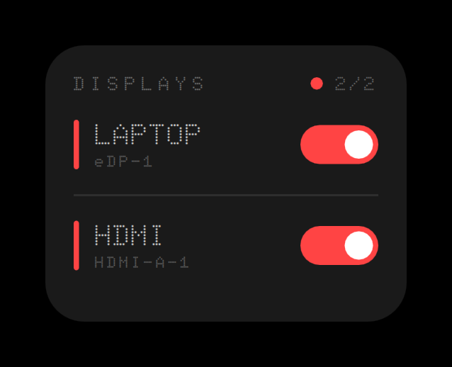
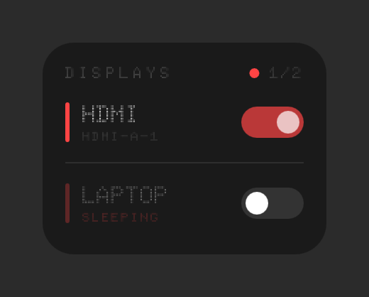
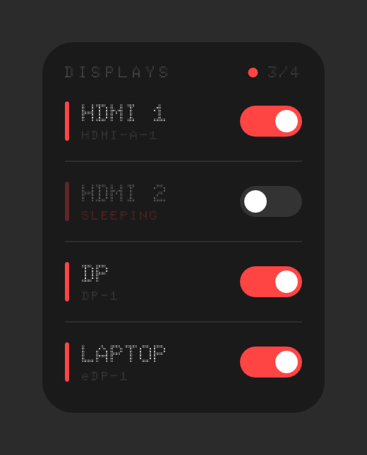
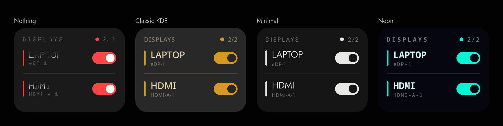

<div align="center">

# Nothing Display Toggle

**Switch any display on or off in one click, from the desktop or the panel.**

[](https://github.com/fatihaydost/nothing-display-toggle/releases/latest)
[](https://store.kde.org/p/2376129/)
[](https://kde.org/plasma-desktop/)

[](LICENSE)

A KDE Plasma 6 widget in the style of Nothing OS.



</div>

## What it does

Plasma normally sends you through System Settings → Display Configuration every time you want a
screen gone. This widget gives each connected display its own switch instead.

- **One switch per display**, found automatically and named by type (`LAPTOP`, `HDMI 1`, `DP`, …).
  You can rename them.
- **The last display that is on cannot be switched off**, so you never lock yourself out.
- **On the desktop it is a card. On a panel it is a row of switches.** Past a display count you
  choose (two by default), the row turns into a small `3/4` badge that opens the card.
- **Four looks**: Nothing, Classic KDE, Minimal and Neon. You can also set your own accent,
  background and text colours, and make the card see-through on the desktop.

| One display asleep | Four displays |
|:---:|:---:|
|  |  |

On a panel:




> [!IMPORTANT]
> Switching a display off takes it out of the desktop layout. Anything on it moves to another
> screen, and that includes this widget. Keep a copy on a panel or on every screen, so there is
> always one left to switch it back on.

## Install

Needs KDE Plasma 6, on Wayland or X11. It relies on `kscreen-doctor` and the `plasma5support`
QML module, and both normally come with Plasma.

**From the KDE Store.** Right-click the desktop → **Add Widgets…** → **Get New Widgets…** →
**Download New Plasma Widgets**, and search for *Nothing Display Toggle*. It is also on the
[KDE Store](https://store.kde.org/p/2376129/).

**From a release.** Download `nothing-display-toggle.plasmoid` from
[Releases](https://github.com/fatihaydost/nothing-display-toggle/releases), then run:

```bash
kpackagetool6 --type Plasma/Applet --install nothing-display-toggle.plasmoid
```

To update an existing copy, run the same command with `--upgrade` instead of `--install`.

**From source.**

```bash
git clone https://github.com/fatihaydost/nothing-display-toggle.git
cd nothing-display-toggle
./install.sh --reload
```

`--reload` restarts Plasma so that a copy already on screen picks up the new code. If you are
coming from 1.0.x, `install.sh` also replaces the old separate panel package.

Then right-click the desktop or a panel → **Add Widgets…** → *Nothing Display Toggle*. To change
its look, panel behaviour or display names, right-click the widget → **Configure…**.

**Uninstall:**
`kpackagetool6 --type Plasma/Applet --remove io.github.fatihaydost.displaytoggle`

## License

GPL-3.0-or-later. The bundled Doto and Jost fonts are under the SIL Open Font License 1.1; their
licence files are in [`package/contents/fonts/`](package/contents/fonts).
